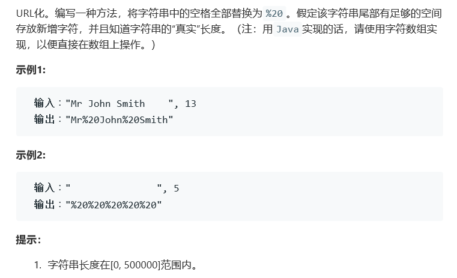

# 题目




# 算法

```python

```

```c++
class Solution {
public:
    string replaceSpaces(string S, int length) {
        /*
        //原始版本，解决不聊全空格的情况
        //所以length就很重要了。是否可以采用length补全的方法？
            stringstream is(S);
            string tmp,res;
            while(getline(is,tmp,' ')){
                if(tmp == "")
                    continue;
                res += tmp + "%20";
            }
            int loc = res.rfind('%');
            return res.substr(0, loc);
        */
        /*
        //出现问题，也就是length的定义，因为%20的扩展我们实际的length定义应该是将%20视为一体的v操作
        stringstream is(S);
        string tmp,res;
        while(getline(is,tmp,' ')){
            if(tmp == "")
                continue;
            res += tmp + "%20";
        }
        while(res.length() < length)
            res += "%20";
        int loc = res.rfind('%');
        return res.substr(0, loc);
        */
        //想复杂了，但是时间效率真的好低
        string res;
        for(int i = 0; i < length; i++){
            if(S[i] == ' ')
                res += "%20";
            else{
                res += S[i];
            }
        }
        return res;
    }
};
```

