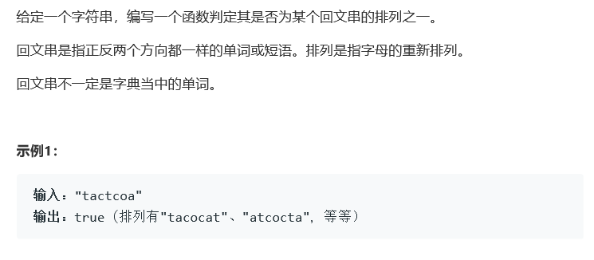

# 题目




# 算法

```python

```

```c++
class Solution {
public:
    bool canPermutePalindrome(string s) {
        //保证奇数出现的字母只有一个。  
        map<char,int> dic;
        bool mark = false;
        for(int i = 0; i < s.size(); i++)
            dic[s[i]]++;
        for(auto c:dic){
            int tmp = c.second;
            bool t = tmp == tmp/2*2;
            if(t){
                continue;
            }else{
                if(!mark){
                    mark = true;
                }else{
                    return false;
                }
            }
        }
        return true;
    }
};
```

