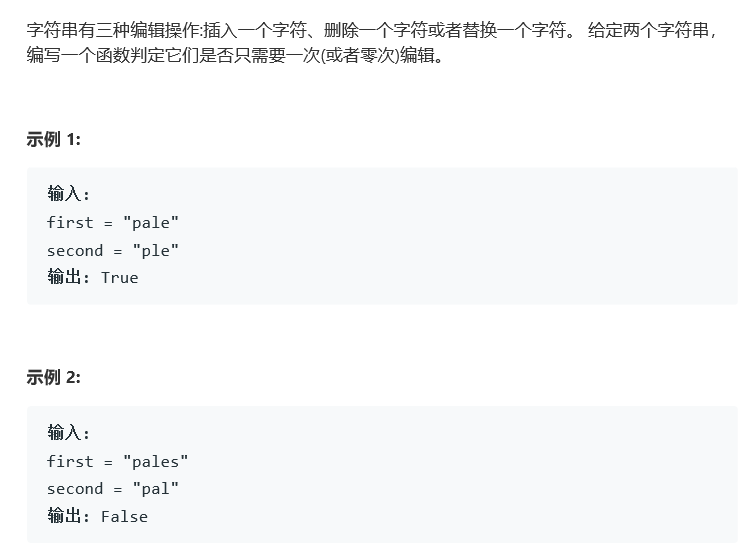

# 题目




# 算法

```python

```

```c++
class Solution {
public:
    bool two(string& first, string& second, int i, int j) {
        int size1 = first.size(),size2 = second.size();
        if(size1 - i != size2 - j)
            return false;
        bool res = true;
        for(; i < size1; i++){
            if(first[i] == second[j]){
                j++;
            }else{
                res = false;
                break;
            }
        }
        return res;
    }
    bool oneEditAway(string first, string second) {
        int size1 = first.size(),size2 = second.size(), dif = abs(size1 - size2);
        if(dif > 1)
            return false;
        int i = 0, j = 0, num = 0;
        for(; i < size1; i++){
            if(first[i] == second[j]){
                j++;
                continue;
            }else{
                //i != j
                num++;
                if(num > 1)
                    return false;
                else{
                    return (two(first,second,i,j+1) || two(first,second,i+1,j+1) || two(first,second, i+1, j));//可以解决删除 可以解决修改 可以解决添加
                }
            }
        }
        return true;
    }
};
```

