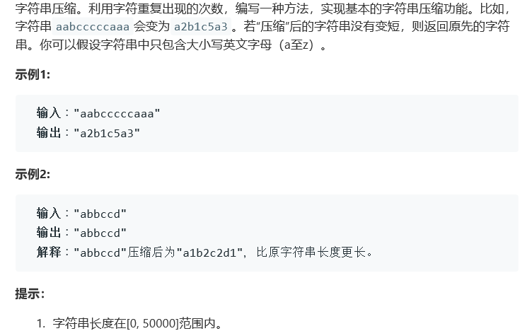

# 题目



# 算法

```python

```

```c++
class Solution {
public:
    string compressString(string S) {
        int i = 0, num = 0, size = S.length();
        string res = "";
        for(; i < size; i++){
            char tmp = S[i];
            num++;
            while(S[++i] == tmp){
                ++num;
            }
            i--;
            res += tmp + to_string(num);
            num = 0;
        }
        return (res.length() < S.length())? res:S;
    }
};
```

