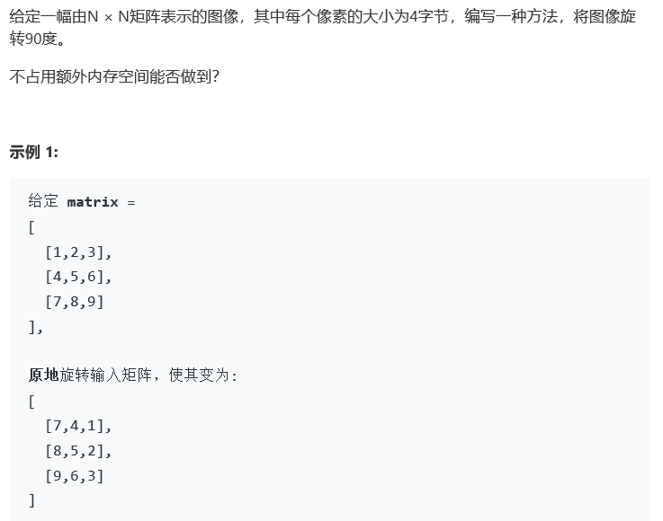
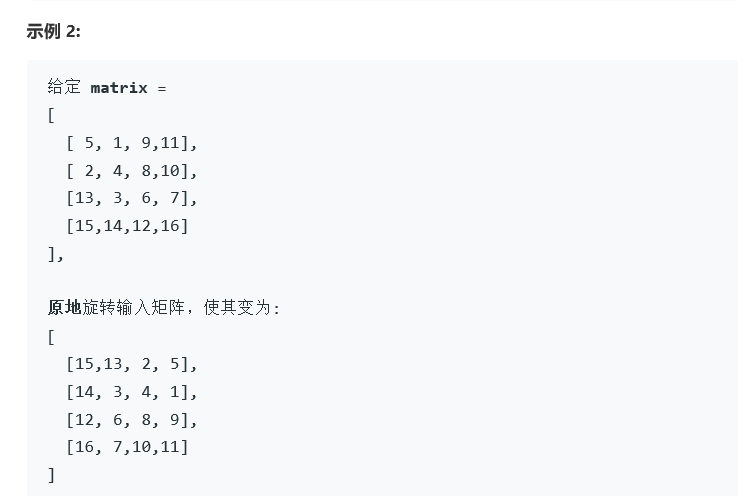

# 题目




# 算法

```python

```

```c++
class Solution {
public:
    void rotate(vector<vector<int>>& matrix) {
         int n = matrix.size();
        int mid = (n == n/2*2)? n/2:(n/2+1);
        for(int i = 0; i < mid; i++){
            for(int j = 0; j < n/2; j++){
                int tmp = matrix[i][j];
                matrix[i][j] = matrix[n-1-j][i];
                matrix[n-1-j][i] = matrix[n-1-i][n-1-j];
                matrix[n-1-i][n-1-j] = matrix[j][n-1-i];
                matrix[j][n-1-i] = tmp;
            }
        }
    }
};
```

