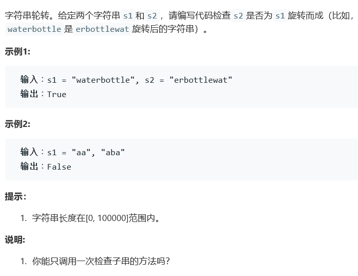

# 题目




# 算法

```python

```

```c++
class Solution {
public:
    bool isFlipedString(string s1, string s2) {
        int size1 = s1.length(), size2 = s2.length();
        if(size1 != size2)
            return false;
        if(size1 == 0)
            return true;
        for(int i = 0; i < size1; i++){
            bool mark = true;
            for(int j = 0; j < size1; j++){
                if(s1[j] != s2[(i+j)%size1]){
                    mark = false;
                    break;
                }                    
            }
            if(mark)
                return true;
        }
        return false;
    }
};
```

