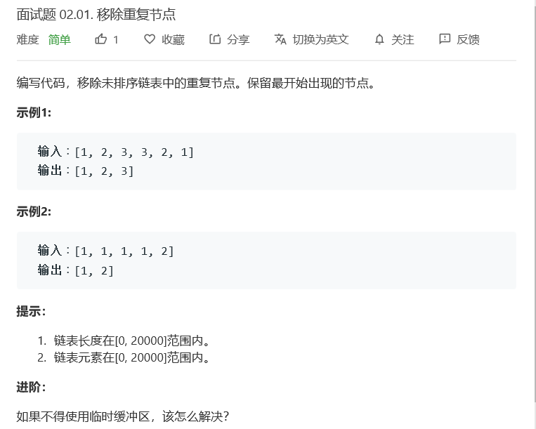

# 题目




# 算法

```python

```

```c++
/**
 * Definition for singly-linked list.
 * struct ListNode {
 *     int val;
 *     ListNode *next;
 *     ListNode(int x) : val(x), next(NULL) {}
 * };
 */
class Solution {
public:
    ListNode* removeDuplicateNodes(ListNode* head) 
    {
        if(head == NULL || head->next == NULL)
        {
            return head;
        }
        ListNode* p1 = head;
        ListNode* p2 = NULL;
        ListNode* tmp = NULL;
        while(p1 != NULL)
        {
            tmp = p1;
            p2 = p1->next;
            while(p2 != NULL)
            {
                if(p1->val == p2->val)
                {
                    tmp->next = p2->next;
                }
                else
                {
                    tmp = p2;
                }
                p2 = tmp->next;
            }
            p1 = p1->next;
        }
        return head;
    }
	ListNode* removeDuplicateNodes1(ListNode* head) {
        //pretty better one
        if(head == nullptr || head->next == nullptr)    
            return head;
        map<int,bool> dic;   
        ListNode* cur = head->next,*pre = head;
        dic[pre->val] = true;
        while(cur){
            if(dic.count(cur->val) != 0){
                ListNode* tmp = cur->next;
                if(tmp != nullptr){
                    pre->next = tmp;
                }else{
                    pre->next = nullptr;
                }
                cur = cur->next;
            }else{
                dic[cur->val] = true;
                pre = cur;
                cur = cur->next;
            }
        }
        return head;
    }
};
```

