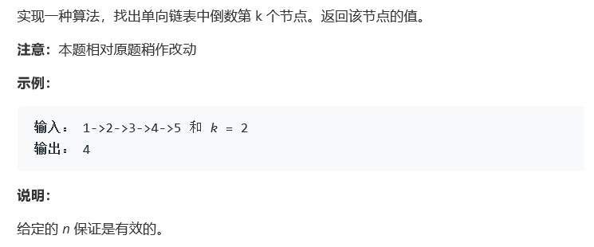

# 题目



# 算法

```python

```

```c++
/**
 * Definition for singly-linked list.
 * struct ListNode {
 *     int val;
 *     ListNode *next;
 *     ListNode(int x) : val(x), next(NULL) {}
 * };
 */
 
class Solution {
public:
    int kthToLast(ListNode* head, int k) {
        if(!head) return -1;
        ListNode* first = head;
        for(int i = 1 ;i<k;++i){
            first = first->next;
        }
        ListNode* second = head;
        if(first == NULL ) return head->val;
        first = first->next;
        while(first != NULL){
            first = first->next;
            second = second->next;
        }
        return second->val;
    }
};
```

