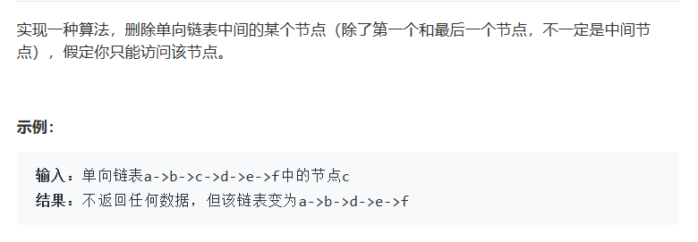

# 题目



# 算法

```python

```

```c++
/**
 * Definition for singly-linked list.
 * struct ListNode {
 *     int val;
 *     ListNode *next;
 *     ListNode(int x) : val(x), next(NULL) {}
 * };
 */
class Solution {
public:
    void deleteNode(ListNode* node, int n) {
        if(!node->next){
            //测试了一下，这种情况系统还是输出了原来的数
            node=NULL;
            return;
        }
        if(node->val==n){
            //删除第一个节点写node=node->next还不行，不知道怎么设计的题
            node->val=node->next->val;
            node->next=node->next->next;
            return;
        }
        while(node->next->val!=n){
            node=node->next;
        }
        node->next=node->next->next;
    }
};
```

核心在于拆下家，把下家的值拿来，然后拆下家，这样就不用找pre！！