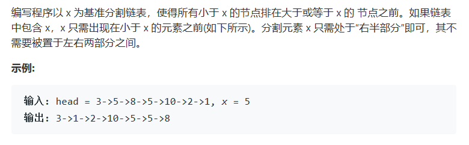

# 题目



# 算法

```python

```

```c++
/**
 * Definition for singly-linked list.
 * struct ListNode {
 *     int val;
 *     ListNode *next;
 *     ListNode(int x) : val(x), next(NULL) {}
 * };
 */
class Solution {
public:
    ListNode* partition(ListNode* head, int x) {
        ListNode * res = new ListNode(0);
        ListNode * rescur = res;//这样可以直接避免第一个赋值，对于找到的第一个小值不需要特殊处理
        ListNode * cur = head, *pre = head;
        while(cur){
            if(cur->val < x){
                rescur->next = cur;
                rescur = rescur->next;
                if(cur == head){
                    cur = cur->next;
                    pre = cur;
                    head = cur;
                }else{
                    pre->next = cur->next;
                    cur = cur->next;
                }
            }else{
                pre = cur;
                cur = cur->next;
            }
        }
        rescur->next = head;
        return res->next;
    }
};
```

