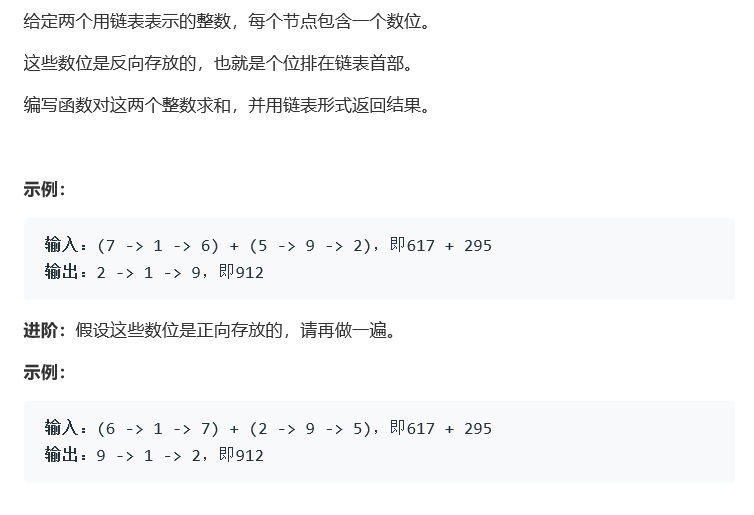

# 题目




# 算法

```python

```

```c++
/**
 * Definition for singly-linked list.
 * struct ListNode {
 *     int val;
 *     ListNode *next;
 *     ListNode(int x) : val(x), next(NULL) {}
 * };
 */
class Solution {
public:
    ListNode* addTwoNumbers(ListNode* l1, ListNode* l2) {
        bool up = false;
        ListNode* cur1 = new ListNode(0),* cur2 = new ListNode(0);
        cur1->next = l1, cur2->next = l2;
        while(cur1->next != nullptr && cur2->next != nullptr){
            int num = cur1->next->val + cur2->next->val;
            if(up)
                num += 1;
            
            if(num >= 10)
                up = true;
            else
                up = false;//处理进位
            cur1->next->val = num%10;
            cur1 = cur1->next;
            cur2 = cur2->next;
            cout<<up;
        }
        if(cur2->next){
            if(up){
                int num = cur2->next->val + 1;
                if(num >= 10)
                    up = true;
                else
                    up = false;//处理进位
                cur2->next->val = num%10;
                cout<<"fuck";
            }                
            cur1->next = cur2->next;
            cur1 = cur1->next;
        }
        while(up){
            if(cur1->next){
                int num = cur1->next->val + 1;
                if(num >= 10)
                    up = true;
                else
                    up = false;//处理进位
                cur1->next->val = num%10;
            }
            else{
                cur1->next = new ListNode(1);
                up = false;
            }
            cur1 = cur1->next;
        }
        return l1;
    }
};
```

