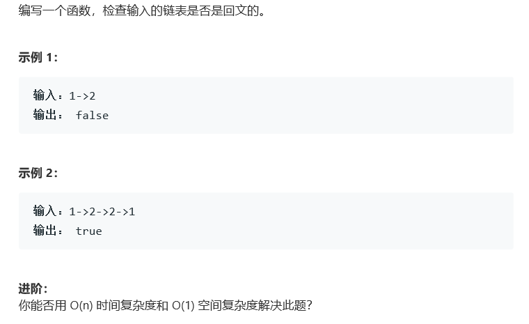

# 题目




# 算法

```python

```

```c++
/**
 * Definition for singly-linked list.
 * struct ListNode {
 *     int val;
 *     ListNode *next;
 *     ListNode(int x) : val(x), next(NULL) {}
 * };
 */
class Solution {
public:
    bool isPalindrome(ListNode* head) {
        string res = "";
        while(head){
            res += '0'+head->val;
            head = head->next;
        }
        int size = res.length();
        for(int i = 0; i < size / 2; i++){
            if(res[i] != res[size - 1 - i])
                return false;
        }
        return true;
    }
};
```

