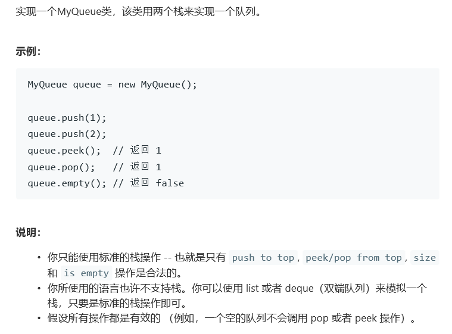

# 题目




# 算法

```python

```

```c++
class MyQueue {
    stack<int> s1;
    stack<int> s2;
public:
    /** Initialize your data structure here. */
    MyQueue() {
        
    }
    
    /** Push element x to the back of queue. */
    void push(int x) {
        s1.push(x);
    }
    /** Removes the element from in front of queue and returns that element. */
    int pop() {
        if (s1.empty())
        {
            std::cerr << "empty queue! " << std::endl;
            std::exit(1);
        }
        else
        {
            int temp;
            while (!s1.empty())
            {
                temp = s1.top();
                s2.push(temp);
                s1.pop();
            }
            int res = s2.top();
            s2.pop();
            while (!s2.empty())
            {
                temp = s2.top();
                s1.push(temp);
                s2.pop();
            }
            return res;
        }
    }
    
    /** Get the front element. */
    int peek() {
        if (s1.empty())
        {
            std::cerr << "empty queue!" << std::endl;
            std::exit(1);
        }
        else 
        {
            int temp;
            while (!s1.empty())
            {
                temp = s1.top();
                s2.push(temp);
                s1.pop();
            }
            int res = s2.top();
            while(!s2.empty())
            {
                temp = s2.top();
                s1.push(temp);
                s2.pop();
            }
            return res;
        }
    }
    
    /** Returns whether the queue is empty. */
    bool empty() {
        return s1.empty();
    }
};

/**
 * Your MyQueue object will be instantiated and called as such:
 * MyQueue* obj = new MyQueue();
 * obj->push(x);
 * int param_2 = obj->pop();
 * int param_3 = obj->peek();
 * bool param_4 = obj->empty();
 */

```

