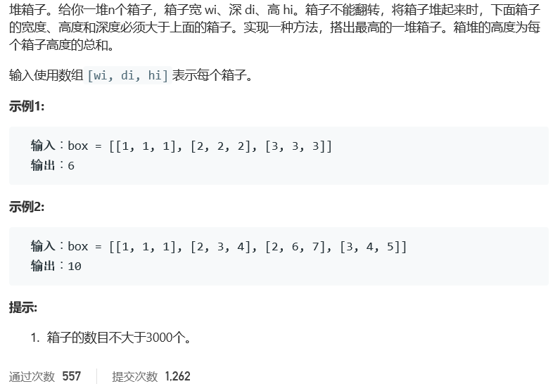

# 题目




# 算法

```python

```

```c++
class Solution {
public:
    int pileBox(vector<vector<int>>& box) {
        sort(box.begin(), box.end(), [](const vector<int>& a, const vector<int>& b) {return a[0]<b[0];});
        vector<int> dp(box.size(),0);
        dp[0]=box[0][2];
        int ans=dp[0];
        for(int i=1;i<box.size();i++){
            int maxh=0;//必须初始化为0
            for(int j=0;j<i;j++)
                if(box[j][0]<box[i][0]&&box[j][1]<box[i][1]&&box[j][2]<box[i][2])
                    maxh=max(maxh,dp[j]);
            dp[i]=maxh+box[i][2];
            ans=max(ans,dp[i]);
        }
        return ans;
    }
};
```

