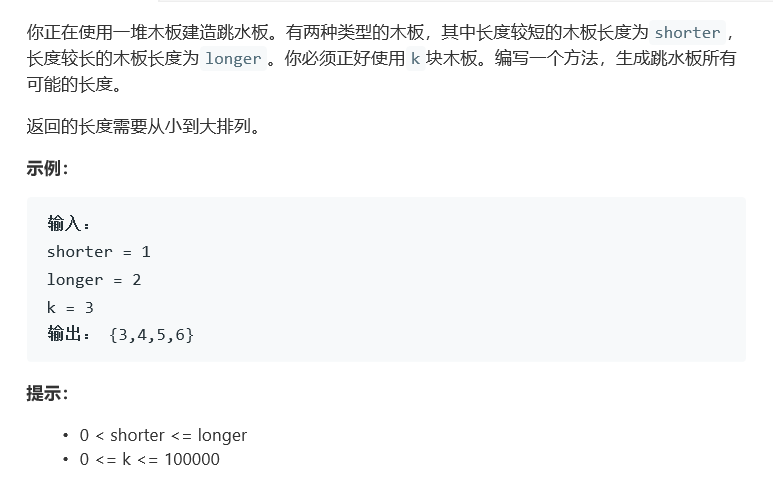

# 题目




# 算法

```python

```

```c++
class Solution {
public:
    vector<int> divingBoard(int shorter, int longer, int k) {
        if(k == 0) return vector<int>();
       int dif = longer - shorter, num = shorter * k;
       vector<int> res;
       res.push_back(num);
       for(int i = 0; i < k && dif != 0; i++){
           num += dif;
           res.push_back(num);
       }
       return res;
    }
};//两个特殊情况，一个是k=0，另一个是shorter = longer
```

