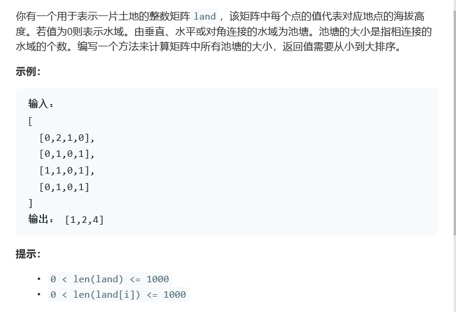

# 题目




# 算法

```python

```

```c++
class Solution {
public:
    int n,m;
    void dfs(vector<vector<int>>& land, int i, int j, int& num) {
        //八个方向！
        if(land[i][j] == 0){
            land[i][j] = -1;
            num++;
            bool a = i > 0, b = i < n-1, c = j > 0, d = j < m -1;
            if(a){
                dfs(land, i-1, j, num);
                if(c)
                    dfs(land, i-1, j-1, num);
                if(d)
                    dfs(land, i-1, j+1, num);
            }
                
            if(i < n-1){
                dfs(land, i+1, j, num);
                if(c)
                    dfs(land, i+1, j-1, num);
                if(d)
                    dfs(land, i+1, j+1, num);
            }
               
            if(c)
                dfs(land, i, j-1, num);
            if(d)
                dfs(land, i, j+1, num);
        }
    }
    vector<int> pondSizes(vector<vector<int>>& land) {
        n = land.size();
        if(n == 0)
            return vector<int>();
        m = land[0].size();
        if(m == 0)
            return vector<int>();
        vector<int> res;
        for(int i = 0; i < n; i++){
            for(int j = 0; j < m; j++){
                if(land[i][j] < 0)
                    continue;
                else{
                    if(land[i][j] == 0){
                        int num = 0;
                        dfs(land, i, j, num);
                        res.push_back(num);
                    }
                }
            }
        }
        sort(res.begin(),res.end());
        return res;
    }
};
```

