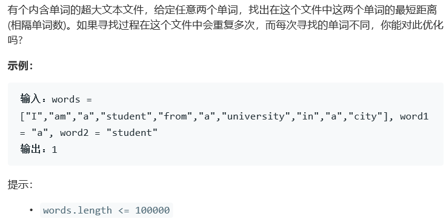

# 题目



# 算法

```python

```

```c++
class Solution {
public:
    int findClosest(vector<string>& words, string word1, string word2) {
        int size = words.size(), res = INT_MAX, loc1 = 0, loc2 = 0, loc = 0;
        bool find1 = false, find2 = false, done;
        while(loc < size){
            done = false;
            if(words[loc] == word1){
                find1 = true;
                loc1 = loc;
                done = true;
            }
            if(words[loc] == word2){
                find2 = true;
                loc2 = loc;
                done = true;
            }
            if(done && find1 && find2)
                res = min(abs(loc1 - loc2),res);
            loc++;
        }
        return res;
    }
};
```

