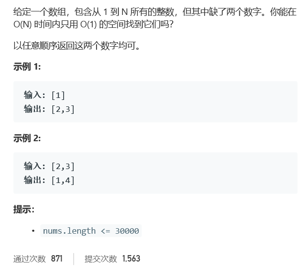

# 题目




# 算法

```python

```

```c++
class Solution {
public:
    vector<int> missingTwo(vector<int>& nums) {
       sort(nums.begin(),nums.end());
       vector<int> res;
       int size = nums.size(), loc = 0,dif = 1;
       if(size == 1){
           if(nums[0] == 1){
               res.push_back(2);
               res.push_back(3);
           }else if(nums[0] == 2){
               res.push_back(1);
               res.push_back(3);
           }else{
               res.push_back(1);
               res.push_back(2);
           }
           return res;
       }
       while(loc < size){
           if(nums[loc]!= loc+dif){
               res.push_back(loc+dif);
               dif ++;
               loc--;
               if(res.size() == 2)
                break;
           }
           loc++;
       }
       if(res.size() == 0){
           res.push_back(nums[size-1]+1);
           res.push_back(nums[size-1]+2);
       }
       if(res.size() == 1){
           res.push_back(nums[size-1]+1);
       }
       return res;
    }
};
```


