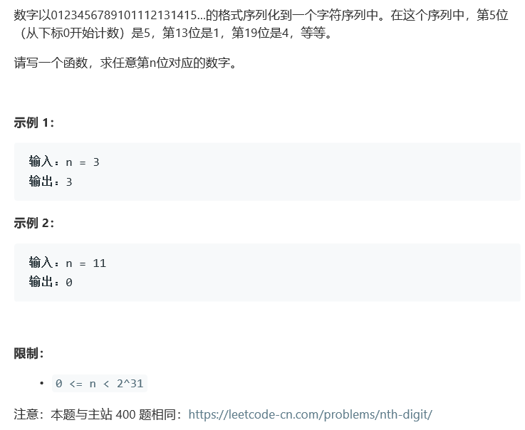

# 题目



# 算法

```python

```

```c++
class Solution {
public:
    int findNthDigit(int n) {
        long long int num = 10, level = 9, digit = 1, pre = 1 ;
        if(n < num)
            return n;
        while( n >= num){
            pre = num;
            level *= 10;
            digit += 1;
            num += level*digit;
        }
        int dif = n - pre;
        int nth = dif/digit, loc = (dif)%digit;//这一层里第nth个数，这个数从左数第loc位（0开始）。
        string res = to_string(level/9 + nth);
        //cout<<res<<" "<<num<<" "<<pre<<" "<<loc<<" "<<digit<<" "<<dif<<" "<<nth<<" "<<level<<endl;
        return res[loc]-'0';
    }
};
```

