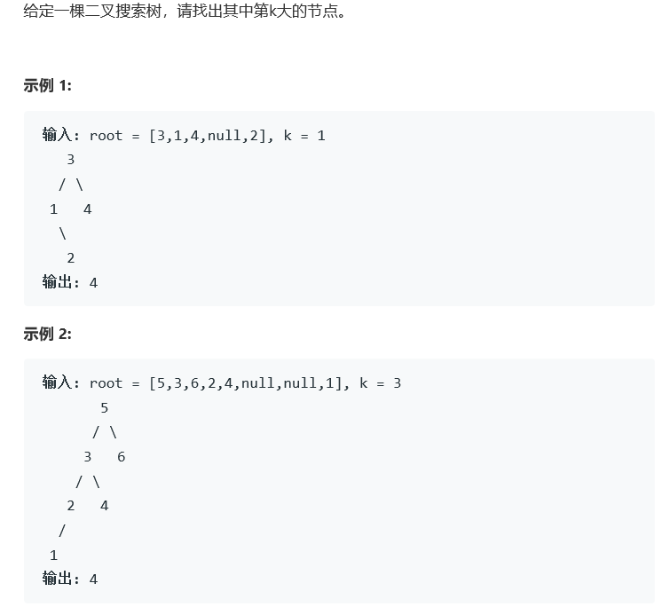

# 题目



# 算法

```python

```

```c++
/**
 * Definition for a binary tree node.
 * struct TreeNode {
 *     int val;
 *     TreeNode *left;
 *     TreeNode *right;
 *     TreeNode(int x) : val(x), left(NULL), right(NULL) {}
 * };
 */
class Solution {
public:
    void insert(TreeNode* root, vector<int>& res){
        res.push_back(root->val);
        if(root->left)
            insert(root->left,res);
        if(root->right)
            insert(root->right,res);
    }
    int kthLargest(TreeNode* root, int k) {
        vector<int> res;
        insert(root, res);
        sort(res.begin(), res.end());
        return res[res.size()-k];
    }
};
```

